# Access Watson Discovery SDU document with Watson Assistant

In this code pattern, we walk you through a working example of a web app that utilizes multiple Watson services to create a better customer care experience.

Using the Watson Discovery Smart Document Understanding (SDU) feature, we will enhance the Discovery model so that queries will be better focused to only search the most relevant information found in a typical users manual.

Using Watson Assistant, we will use a standard customer care dialog to handle a typical conversation between a custmomer and a company representitive. When a customer question involves operation of a product, the Assistant diaglog will communicate with the Discovery service using webhooks.

## How does SDU work?

SDU trains Watson Discovery to extract custom fields in your documents. Customizing how your documents are indexed into Discovery will improve the answers returned from queries.

With SDU, you annotate fields within your documents to train custom conversion models. As you annotate, Watson is learning and will start predicting annotations. SDU models can be exported and used on other collections.

Current document type support for SDU is based on your plan:

Lite plans: PDF, Word, PowerPoint, Excel, JSON, HTML
Advanced plans: PDF, Word, PowerPoint, Excel, PNG, TIFF, JPG, JSON, HTML

Here is a brief video that provides an overview of the benefits of SDU, and a walk-through of how to use it.

[](https://www.youtube.com/watch?v=Jpr3wVH3FVA)

## What is a webhook?

A webhook is a mechanism that allows you to call out to an external program based on something happening in your program. When used in a Watson Assistant dialog skill, a webhook is triggered when the Assistant processes a node that has a webhook enabled. The webhook collects data that you specify or that you collect from the user during the conversation and save in context variables, and sends the data to the Webhook request URL as an HTTP POST request. The URL that receives the webhook is the listener. It performs a predefined action using the information that is provided by the webhook as specified in the webhook definition, and can optionally return a response.

In our example, the webhook will communicate with an IBM Cloud Functions action, which is connected to the Watson Discovery service.

## Flow


1. The document is annotated using Watson Discovery SDU
1. The user interacts with the backend server via the app UI. The frontend app UI is a chatbot that engages the user in a conversation.
1. Dialog between the user and backend server is coordinated using a Watson Assistant dialog skill.
1. If the user asks a product operation question, a search query is passed to a predefined IBM Cloud Functions action.
1. The Cloud Functions action will query the Watson Discovery service and return the results.

# Steps:

1. [Clone the repo](#1-clone-the-repo)
1. [Create IBM Cloud services](#2-create-ibm-cloud-services)
1. [Configure Watson Discovery](#3-configure-watson-discovery)
1. [Create IBM Cloud Functions action](#4-create-ibm-cloud-functions-action)
1. [Configure Watson Assistant](#5-configure-watson-assistant)
1. [Get IBM Cloud services credentials and add to .env file](#6-get-ibm-cloud-services-credentials-and-add-to-env-file)
1. [Run the application](#7-run-the-application)

### 1. Clone the repo

```bash
git clone https://github.com/IBM/watson-discovery-sdu-with-assistant
```

### 2. Create IBM Cloud services

Create the following services:

* [**Watson Discovery**](https://cloud.ibm.com/catalog/services/discovery)
* [**Watson Assistant**](https://cloud.ibm.com/catalog/services/assistant)

### 3. Configure Watson Discovery

#### Import the document

As shown in the video below, launch the **Watson Discovery** tool and create a **new data collection** by selecting the **Upload your own data** option. Give the data collection a unique name. When prompted, select and upload the `ecobee3_UserGuide.pdf` file located in your local `data` directory.


The `Ecobee` is a popular residential thermostat that has a wifi interface and multiple configuration options.

#### Annotate with SDU

Once uploaded, you can then use the `Configure data` option to start the SDU process.

ADD VIDEO ....

#### Store credentials for future use

In upcoming steps, you will need to provide the credentials to access your Discovery collection. The values can be found in the following locations.

The `Collection ID` and `Environment ID` values can be found by clicking the dropdown button [1] located at the top right side of your collection panel:

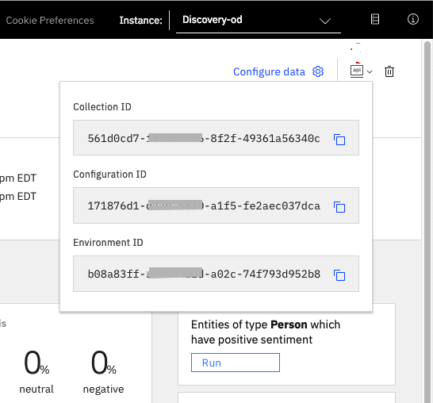

Return to the main panel of your Discovery service, and click the `Service credentials` [1] tab:

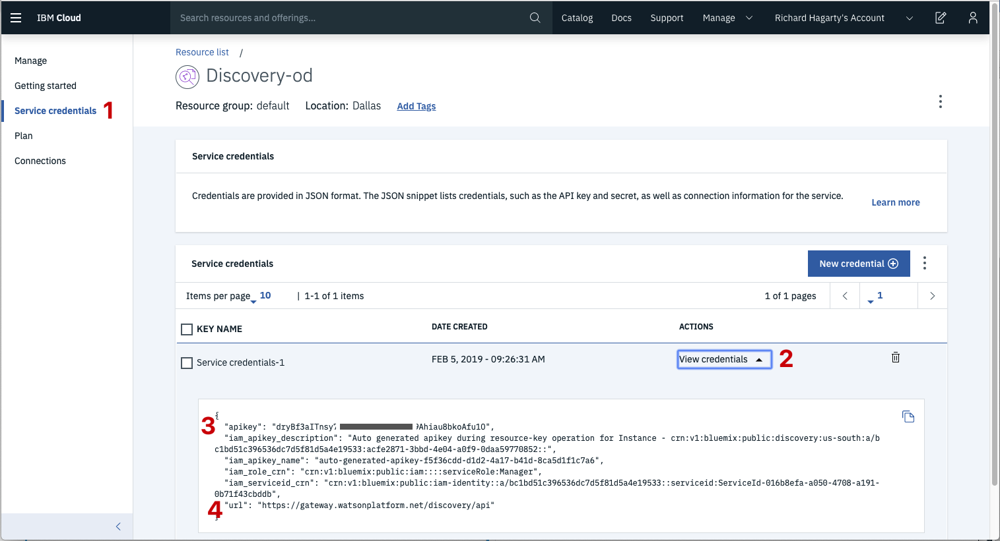

Click the `View credentials` [2] drop-down menu to view the `iam_apikey` [3] and `URL` endpoint [4] for your service.

### 4. Create IBM Cloud Functions action

Start the `Cloud Functions` service by selecting `Create Resource` from the IBM Cloud dashboard. Enter `functions` as the filter [1], then select the `Functions` card [2]:

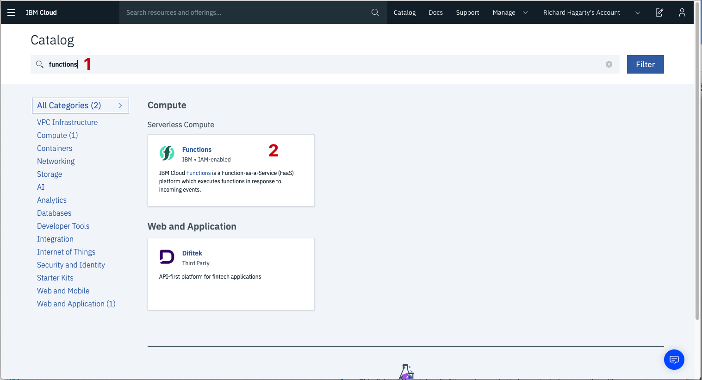

From the `Functions` main panel, click on the `Actions` tab. Then click on `Create`.

From the `Create` panel, select the `Create Action` option.

On the `Create Action` panel, provide a unique `Action Name` [1], keep the default package [2], and select the `Node.js 10` [3] runtime. Click `Create` [4] to create the action.

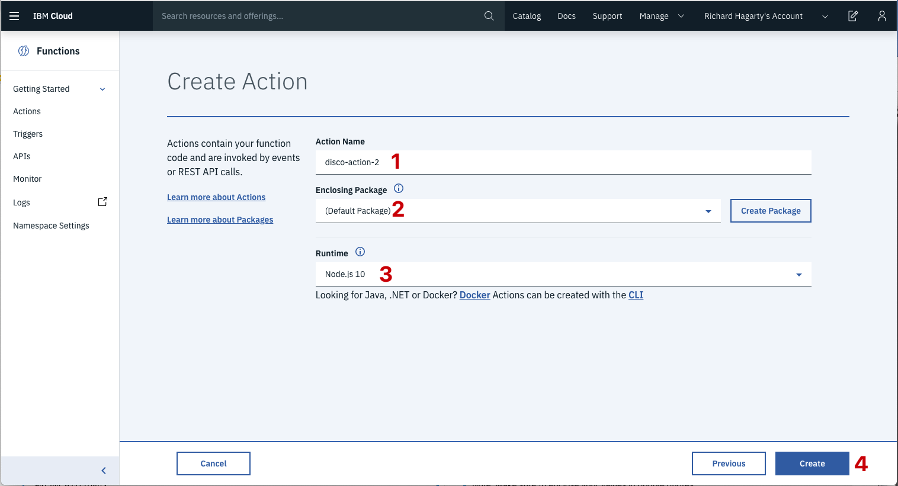

Once your action is created, click on the `Code` tab [1]:

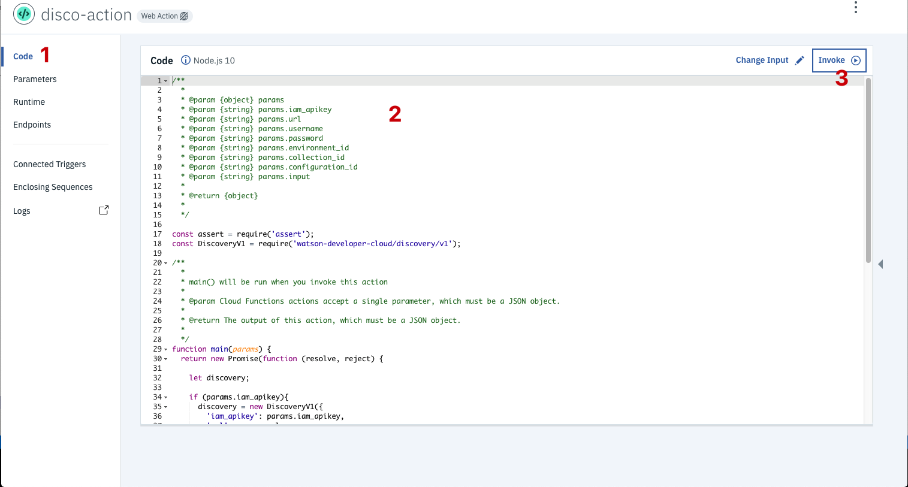

In the code editor window [2], cut and paste in the code from the `disco-action.js` file found in the `/actions` directory of your local repo.

If you press the `Invoke` button [3], it will fail due to credentials not being defined yet. We'll do this next in the following step.

Next, select the `Parameters` tab [1]:


Add the following keys:

* url
* environment_id
* collection_id
* input
* iam_apikey

For values, please use the values associated with the Discovery service you created in the previous step.

> Note: Make sure to enclose your values in double quotes.

For the `input` value [2], use a default question such as "how do I turn on the heater?".

Now that the credentials are set, along with our test question, return to the `Code` panel and press the `Invoke` button again. Now you should see actual results returned from the Discovery service:

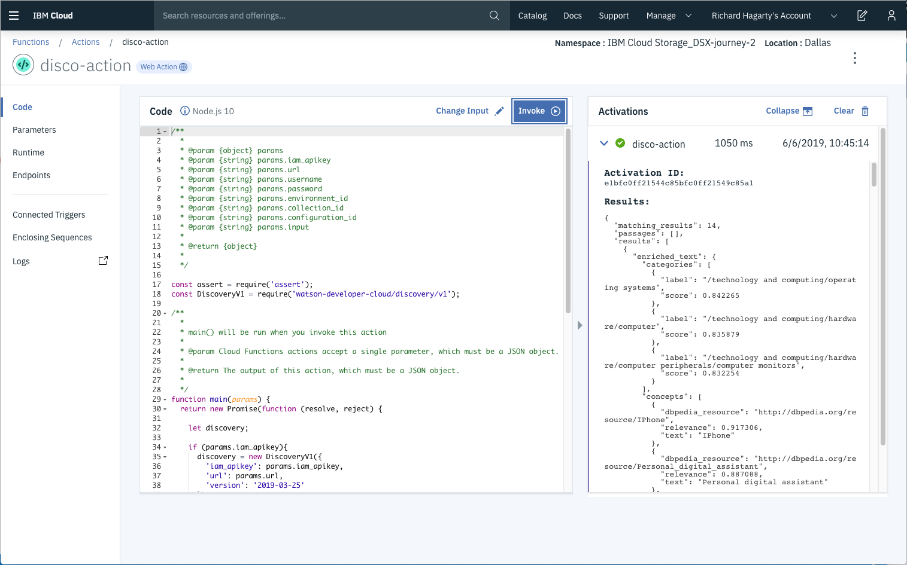

Next, go to the `Endpoints` panel [1]:

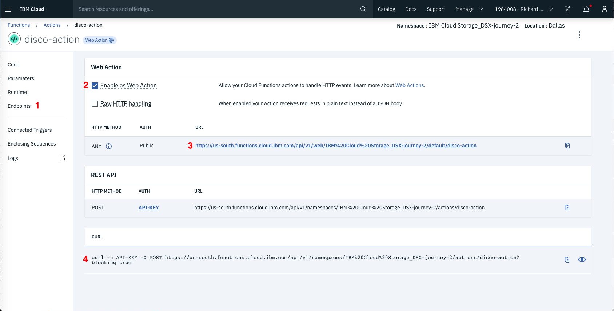

Click the checkbox for `Enable as Web Action` [2]. This will generate a public endpoint URL [3] that should end in `.json`.

Take note of the REST API endpoint value [3], as this will be needed in a future step.

To verify you have entered the correct Discovery parameters, execute the provied `curl` command [4]. If it fails, re-check your parameter values.

> NOTE: An IBM Cloud Functions service will not show up in your dashboard resource list. To return to your defined `Action`, you will need to access Cloud Functions by selecting `Create Resource` from the main dashboard panel (as shown at the beginning of this step).

### 5. Configure Watson Assistant

As shown in the video below, launch the **Watson Assistant** tool and create a new **dialog skill**. Select the `Use sample skill` as your starting point.


This dialog skill contains all of the nodes needed to have a typical call center conversation with a user.

#### Add new intent

Create a new intent that can detect when the user is asking about operating the Ecobee thermostat.

From the `Customer Care Sample Skill` panel, select the `Intents` tab.

Click the `Create intent` button.

Name the intent `#Product_Information`, and at a minimum, enter the following example questions to be associated with it.

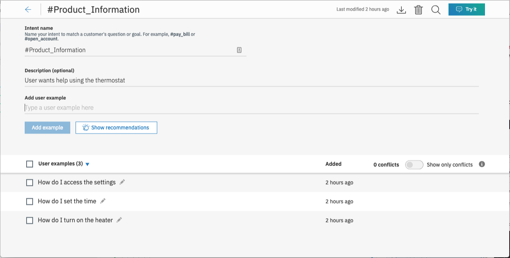

#### Create new dialog node

Now we need to add a node to handle our intent. Click on the `Dialog` [1] tab, then click on the drop down menu for the `Small Talk` node [2], and select the `Add node below` [3] option.

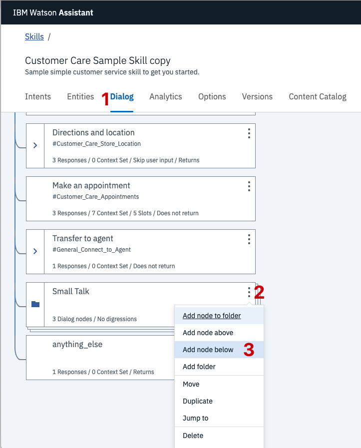

Name the node "Ask about product" [1] and assign it our new intent [2].

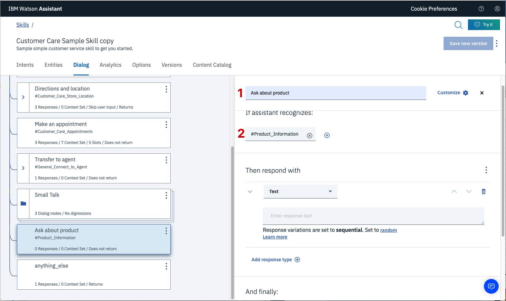

This means that if Watson Assistant recognizes a user input such as "how do I set the time?", it will direct the conversation to this node.

#### Enable webhook from Assistant

Set up access to our WebHook for the IBM Cloud Functions action you created in Step #4.

Select the `Options` tab [1]:

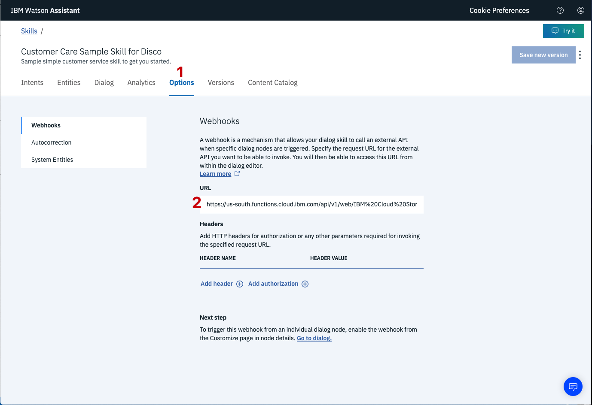

Enter the public URL endpoint for your action [2]. (Note that the URL should end with `.json`).

Return to the `Dialog` tab, and click on the `Ask about product` node. From the details panel for the node, click on `Customize`, and enable Webhooks for this node:

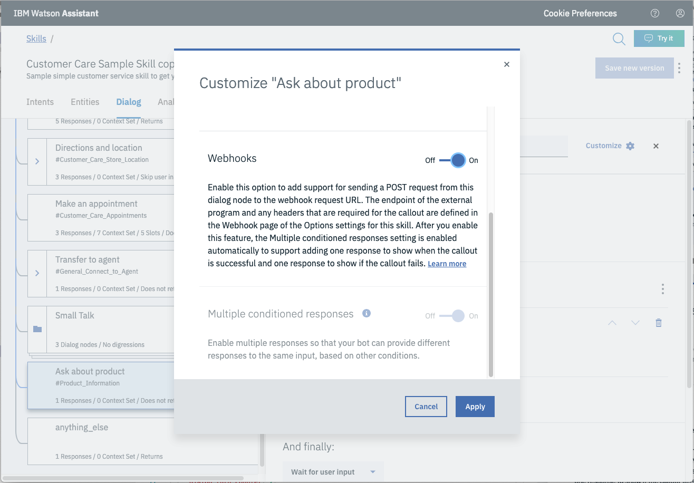

Click `Apply`. The dialog node should now look like this:

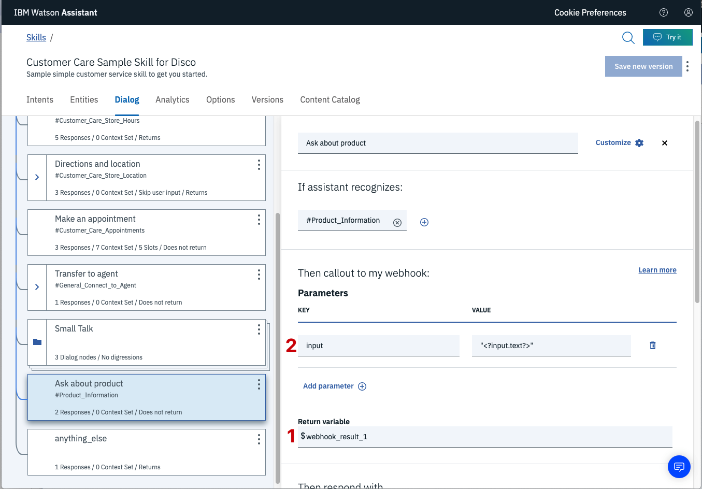

... and this:

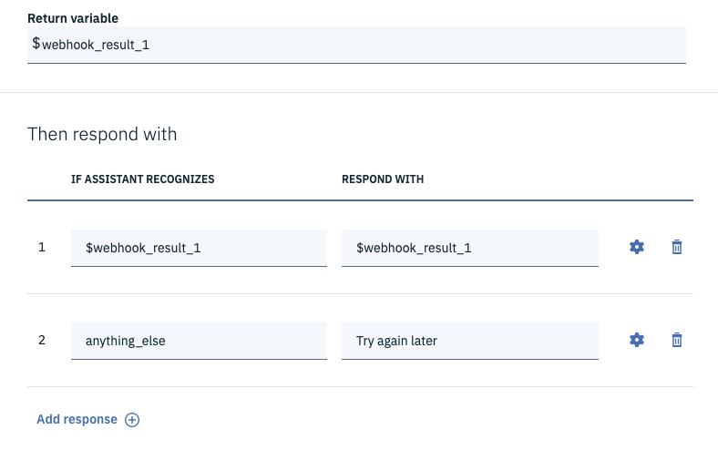

#### Test in Assistant Tooling

From the `Dialog` panel, click the `Try it` button located at the top right side of the panel.

Enter some user input:

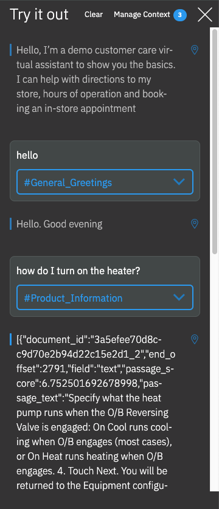

Note that the input "how do I turn on the heater?" has triggered our `Ask about product` dialog node, which is indicated by the `#Product_Information` response.

And because we specified that `$webhook_result_1.passages` be the response, that value is displayed also.

You can also verify that the call was successfully completed by clicking on the `Manage Context` button at the top right. The response from the Discovery query will be stored in the `$webhook_result_1` variable:

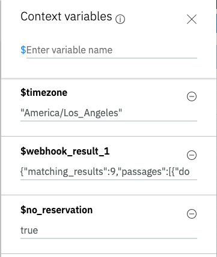

### 6. Get IBM Cloud services credentials and add to .env file

Copy the local `env.sample` file and rename it `.env`:

```bash
cp env.sample .env
```

Update the `.env` file with the credentials from your Assistant service.

```bash
# Copy this file to .env and replace the credentials with
# your own before starting the app.

# Watson Discovery
ASSISTANT_WORKSPACE_ID=<add_assistant_workspace_id>
ASSISTANT_IAM_APIKEY=<add_assistant_iam_apikey>

# Run locally on a non-default port (default is 3000)
# PORT=3000
```

Credentials can be found by clicking the Service Credentials tab, then the View Credentials option from the panel of your created Watson service.

An additional `WORKSPACE_ID` value is required to access the Watson Assistant service. To get this value, select the `Manage` tab, then the `Launch tool` button from the panel of your Watson Assistance service. From the service instance panel, select the `Skills` tab to display the skills that exist for your service. For this tutorial, we will be using the `Custom Skill Sample Skill` that comes with the service:

<p align="center">
  
</p>

Click the option button (highlighted in the image above) to view all of your skill details and service credentials:

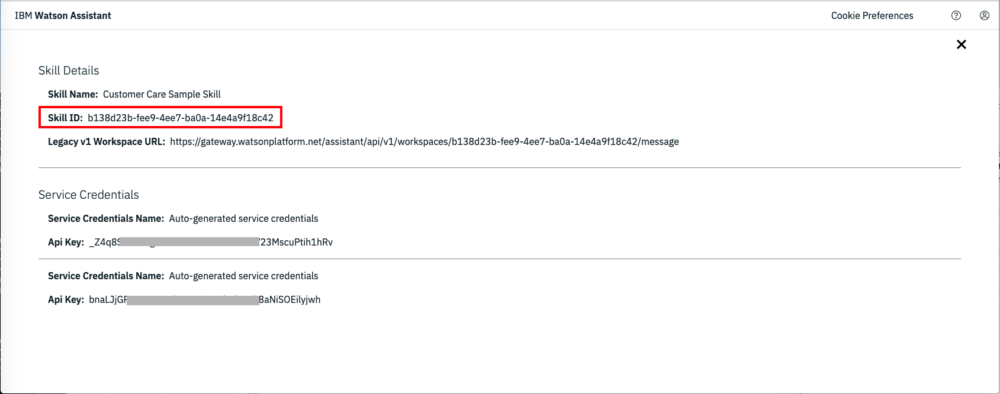

### 7. Run the application

```bash
npm install
npm start
```

Access the UI by pointing your browser at `localhost:3000`.

Sample questions:

* **how do I set a schedule?**
* **how do I set the temperature?**
* **how do I set the time?**

# Sample Output

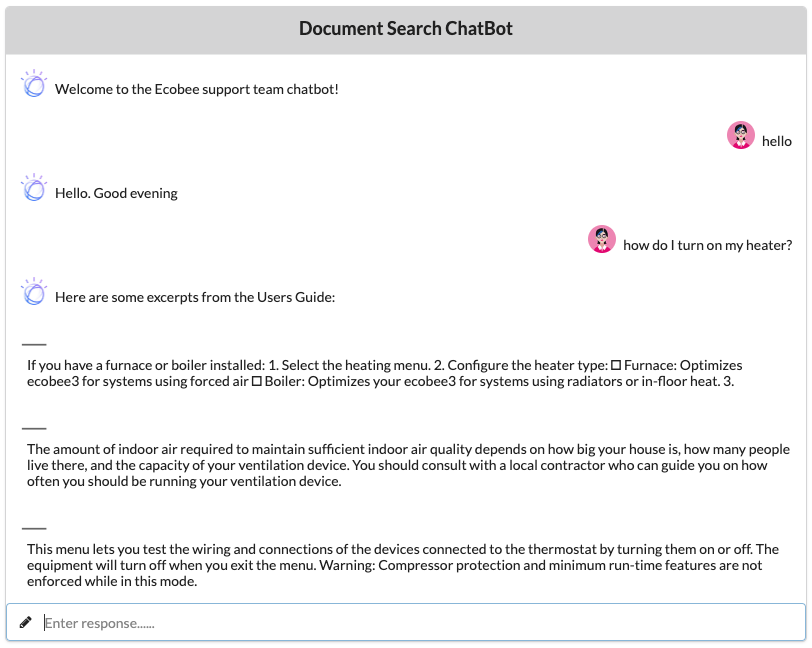

# Access to results in application

* Results will be returned in Assistant context object:

```
{ conversation_id: '70bc6532-d3fb-4e4c-9083-7a1c752ba6ef',
  system: 
   { initialized: true,
     dialog_stack: [ { dialog_node: 'root' } ],
     dialog_turn_counter: 3,
     dialog_request_counter: 3,
     _node_output_map:
      { node_15_1488295465298: [ 0 ],
        response_1_1559767826196: [ 0 ] },
     branch_exited: true,
     branch_exited_reason: 'completed' },
  webhook_result_1:
   { matching_results: 9,
     passages:
      [ { document_id: '3a5efee70d8cc9d70e2b94d22c15e2d1_2',
          end_offset: 2791,
          field: 'text',
          passage_score: 6.752501692678998,
          passage_text: 'Specify what the heat pump runs when the O/B Reversing Valve is engaged: On Cool runs cooling when O/B engages (most cases), or On Heat runs heating when O/B engages. 4. Touch Next. You will be returned to the Equipment configuration menu. Furnaces/Boilers If you have a furnace or boiler installed: 1. Select the heating menu. 2. Configure the heater type',
          start_offset: 2435 },
```

# Learn more

* **Artificial Intelligence Code Patterns**: Enjoyed this Code Pattern? Check out our other [AI Code Patterns](https://developer.ibm.com/technologies/artificial-intelligence/)
* **AI and Data Code Pattern Playlist**: Bookmark our [playlist](https://www.youtube.com/playlist?list=PLzUbsvIyrNfknNewObx5N7uGZ5FKH0Fde) with all of our Code Pattern videos
* **With Watson**: Want to take your Watson app to the next level? Looking to utilize Watson Brand assets? [Join the With Watson program](https://www.ibm.com/watson/with-watson/) to leverage exclusive brand, marketing, and tech resources to amplify and accelerate your Watson embedded commercial solution.

# License

This code pattern is licensed under the Apache Software License, Version 2.  Separate third party code objects invoked within this code pattern are licensed by their respective providers pursuant to their own separate licenses. Contributions are subject to the [Developer Certificate of Origin, Version 1.1 (DCO)](https://developercertificate.org/) and the [Apache Software License, Version 2](https://www.apache.org/licenses/LICENSE-2.0.txt).

[Apache Software License (ASL) FAQ](https://www.apache.org/foundation/license-faq.html#WhatDoesItMEAN)
